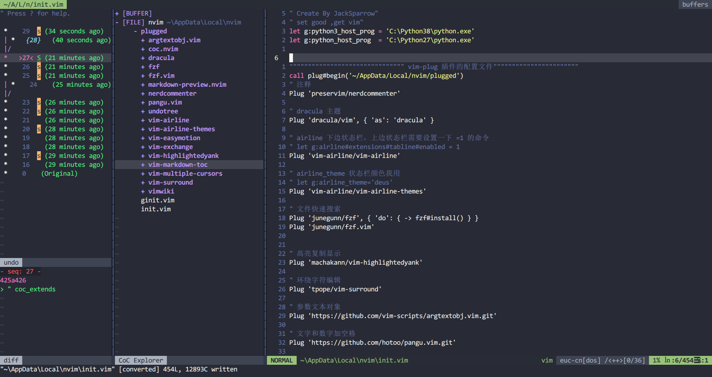

# My Vim Repository

> Get good ,get vim

## Screenshot
nvim-qt:

## Configuration
* [init.vim](./init.vim)
  > for Neovim

* [ginit.vim](./ginit.vim)
  > for Neovim-qt config

* [.ideavimrc](./.ideavimrc)

  > for IntelliJ IDEA

* [.vimrc](./.vimrc)

  > for gVim

Well,there are some [tips](./Tips.md).

## Installation

**Windows:**
---

* Neovim

  > [init.vim](./init.vim) 和 [ginit.vim](./ginit.vim)  放入 `$HOME/AppData/Local/nvim/`  文件夹下

  > plug.vim  放入 `AppData\Local\nvim-data\site\autoload` 文件夹下，去他官网安装也是默认这个位置

  > vim-plug 管理的插件在`~/AppData/Local/nvim/plugged` 里面，可以在 init.vim 中#begin() 参数处更改位置

---

  * IdeaVim

      >  把配置文件 [.ideavim](./.ideavimrc) 放入 `$HOME`  目录即可
  ---

  * gvim -- 不推荐，有很多 bug

    > [.vimrc](./vimrc)  放入`~/` 文件夹下面

    > plug.vim 放入`./vimfiles/autoload/` 文件夹下

    > vim-plug 管理的插件在 `~/.vim` 里面

